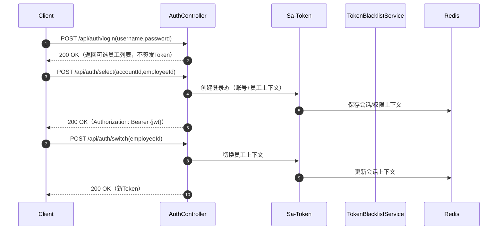
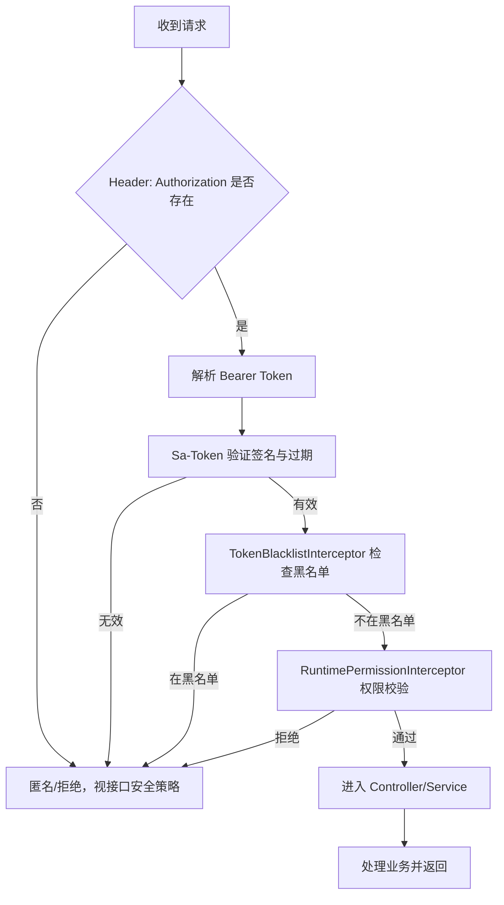
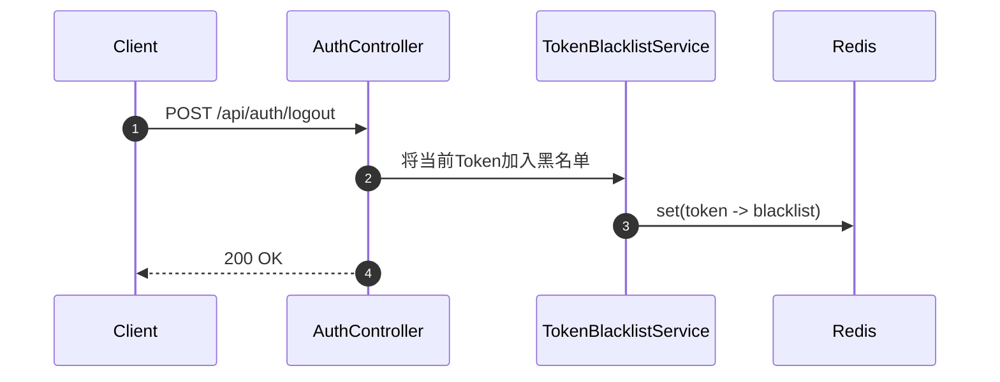

# OpenX3 权限流程图

## 登录与签发 Token（账号/员工上下文）

相关代码：
- [AuthController.java](file:///e:/Code/openx3/backend/openx3-system/src/main/java/com/openx3/system/controller/AuthController.java)
- [StpInterfaceImpl.java](file:///e:/Code/openx3/backend/openx3-system/src/main/java/com/openx3/system/security/StpInterfaceImpl.java)
- [TokenBlacklistService.java](file:///e:/Code/openx3/backend/openx3-system/src/main/java/com/openx3/system/security/TokenBlacklistService.java)
- [SecurityWebMvcConfig.java](file:///e:/Code/openx3/backend/openx3-system/src/main/java/com/openx3/system/security/SecurityWebMvcConfig.java)
- 配置：[application.yml](file:///e:/Code/openx3/backend/openx3-web/src/main/resources/application.yml)（Authorization: Bearer 前缀）

## 请求鉴权与黑名单拦截

说明：
- 黑名单由 [TokenBlacklistService](file:///e:/Code/openx3/backend/openx3-system/src/main/java/com/openx3/system/security/TokenBlacklistService.java) 维护，退出登录时将当前Token加入黑名单
- 权限校验基于用户角色/菜单/权限的匹配与数据范围控制
- 字段级策略由 [FieldPolicyResource/ResponseAdvice](file:///e:/Code/openx3/backend/openx3-system/src/main/java/com/openx3/system/security/field/FieldPolicyResponseAdvice.java) 在响应侧进行脱敏/加密处理

## 退出登录与黑名单

