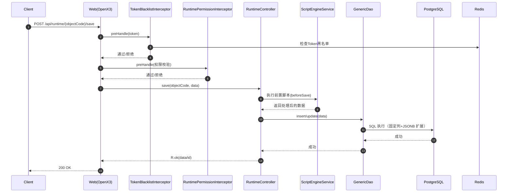
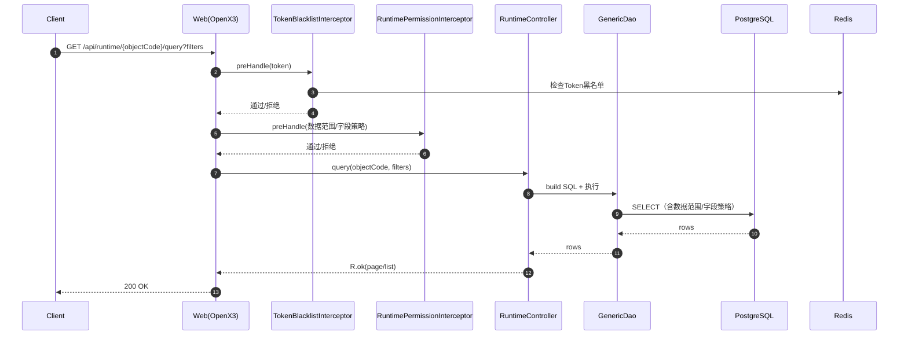
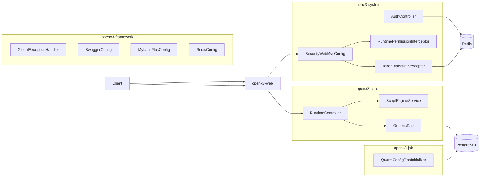

# OpenX3 架构交互图

## 运行时保存流程（Runtime Save）

相关代码：
- [RuntimeController.java](file:///e:/Code/openx3/backend/openx3-core/src/main/java/com/openx3/core/controller/RuntimeController.java)
- [ScriptEngineService.java](file:///e:/Code/openx3/backend/openx3-core/src/main/java/com/openx3/core/service/ScriptEngineService.java)
- [GenericDao.java](file:///e:/Code/openx3/backend/openx3-core/src/main/java/com/openx3/core/support/GenericDao.java)
- [TokenBlacklistInterceptor.java](file:///e:/Code/openx3/backend/openx3-system/src/main/java/com/openx3/system/security/TokenBlacklistInterceptor.java)
- [RuntimePermissionInterceptor.java](file:///e:/Code/openx3/backend/openx3-system/src/main/java/com/openx3/system/security/RuntimePermissionInterceptor.java)
- [SecurityWebMvcConfig.java](file:///e:/Code/openx3/backend/openx3-system/src/main/java/com/openx3/system/security/SecurityWebMvcConfig.java)

## 运行时查询流程（Runtime Query）

## 模块交互总览

